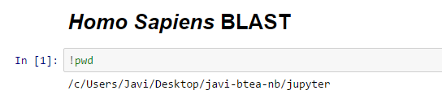
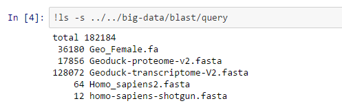
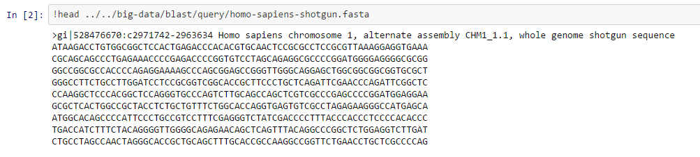
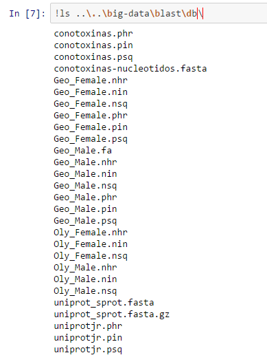
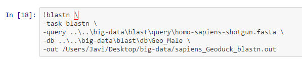
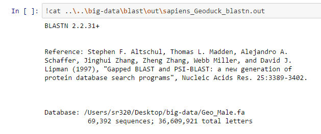
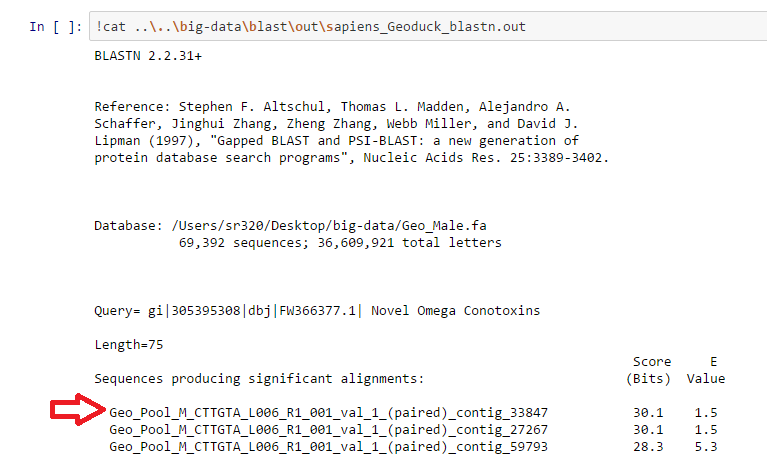
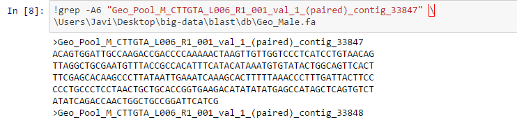

#Secuencia del Gen del _Homo sapiens_

***por Javier Robles***

---
 

*A continuacion se muestra una pagina web con todo el procedimiento en Jupyter de lo que hicimos para crear el blast con un gen de interes de homo sapiens vs la base de datos del geoduck*

#Proceso:

###Nos ubicamos en el folder que vamos a trabajar

---

###Enlistamos los archivos que tenemos en nuestro folder query dos directorios arriba del que estamos trabajando 
por eso ponemos (../..) para subir.
####En este directorio tenemos nuestro gen de interés o problema a analizar.

---

###Muestra el encabezado de nuestra secuencia problema o de interés.
Es para asegurarnos que tenemos la correcta.
*Nótese que es un archivo .fasta*

---

###Enlista las bases de datos con las que vamos a comparar nuestra muestra problema. 
Seleccionaremos la "Geo_male"

---
###Blastea y genera un archivo de salida en la carpeta "out" del folder "blast"

---
###Muestra todo tu archivo .out generado

---

###Selecciona una secuencia de interés para analizarla individualmente

---
###grep nos permite agarrar/mostrar solamente las primeras 6 lineas del archivo .out
comando (-A6)

---
